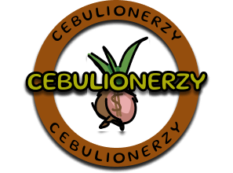

  

<h1 align="center">
    🧅 <b>Project - "Cebulionerzy"</b> 🧅
</h1>

---

## **Table of Contents** :clipboard:
- [Project description :scroll:](#project-description-scroll)
- [Technologies :hammer:](#technologies-hammer)
- [Conclusions :end:](#conclusions-end)
- [Link to download the project :iphone:](#link-to-download-the-project-iphone)

# Project description :scroll:

As part of the credit for the optional course "Programming of mobile applications", I was tasked with making a mobile application/game for Android operating system. The main task was to use the knowledge gained during the class and create my own application. I designed and implemented a game based on the themes of the quiz TV show "Millionaire". I started with a prototype of the application, for which I used the Figma software. The Java programming language was used to implement the project. The questions that are displayed are taken from the Firebase Firestore Database. I tracked the entire project using the Git version control system. The graphics were made in GIMP, while the entire project was created in the Android Studio IDE.

Below you can see a prototype of the application made in Figma:

  

Below you can see sample screenshots from my mobile app:

  
   
  

# Technologies :hammer:

- Java
- Android Studio
- Firebase
- Git
- Figma
- GIMP

# Conclusions :end:

During the labs I had the opportunity to learn about the Android SDK and become familiar with elements such as Fragments and their life cycle, Intents or elements such as Toast, Dialog, Buttons, ListView, etc. The described project shows the use of this acquired knowledge.

# Link to download the project :iphone: 

- ["Cebulionerzy" project APK version available on Google Drive](https://drive.google.com/drive/folders/1d-L1hiP1Aa6qmBPbkaIymXbjjibWLMbz?usp=sharing)
